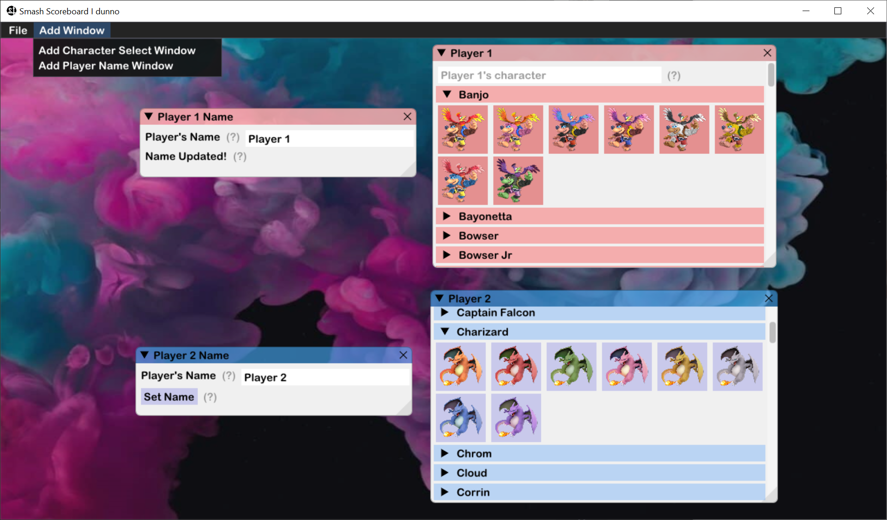

# Super Smash Scoreboard

## Overview

Super Smash Scoreboard is a program developed to help Smash Bros. streamers change images and text displayed on a stream overlay more automatically.

## The Problem

Changing the text for players' names, images for the characters, and other stream essentials can be time consuming sometimes. There's not a standard way of changing these things other than doing it manually through the streaming software (I'm going to specifically mention <a href="https://obsproject.com/">OBS</a>, and use it as my example from here on out).

I saw this problem and decided "Well, I've got nothing better to do today... let's make a program!"

## My Solution

My solution is Super Smash Scoreboard, which as of this writing (being **ROCINSERTDATEHERE**) looks something like this:

Super Smash Scoreboard is a C++ program using the <a>Dear ImGui library</a> with an <a href="https://www.libsdl.org/">SDL2</a> (plus <a href="https://www.libsdl.org/projects/SDL_image/">SDL2_image</a>) and <a href="https://www.opengl.org/">OpenGL 4.6 backend</a>. Right now it's being developed for Windows, but since all the dependencies are cross-platform or base C++ libraries, it should be able to compile for Linux and Mac OS in the future.

Currently the featureset looks something like this:

- Two different kinds of windows!
- Easy to use interface!
- Four different color schemes for windows to make them stand out more!
- Loadable and Savable window configurations!
- Customizable background image!

In the future, I want to also implement:

- More Windows!
- Cross-platform! (if possible)
- Customizable image sets (so it doesn't just have to be images for Smash!)

## Installation

1. Go to the <a href="https://github.com/PSMusicalRoc/SmashScoreboard/releases/latest">releases page</a> of the GitHub repository and download the release (the .zip file that isn't source code).

2. Go to the .zip file in your files and extract it.

3. Profit.

It really is that simple. The executable is called "SmashScoreboard.exe" and should load the program when opened, provided that you have OpenGL 4.6 or later (as of right now, 4.6 is the latest version.)

## Basics of Smash Scoreboard

Smash Scoreboard takes advantage of the Dear ImGui windowing system to allow the user to create windows that accomplish certain tasks. Firstly, let's describe where the basic functionality of the program lies:

1. The `File` menu:
    - This menu currently holds a `Quit` command as well as layout saving and loading options. These layout configs are store within `.sssb` files, which can be created **(not implemented yet)** or loaded by the program itself.

2. The `Add Window` menu:
    - This menu holds the controls for creating the windows that help make the overlay changes. As of right now, these windows can change `.txt` files and `.png` files.

//Start describing the windows somewhere around here