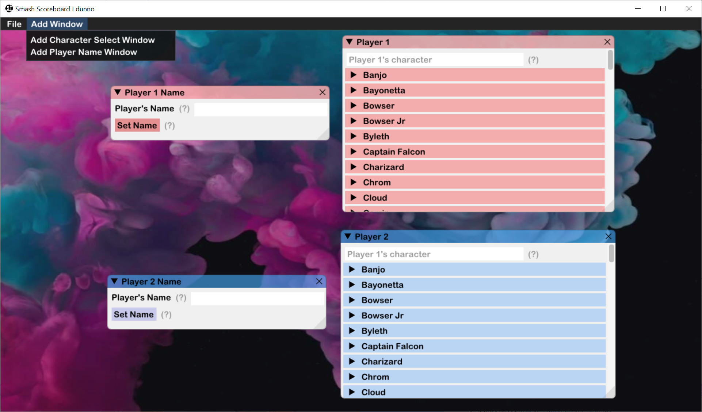

## Basics of Smash Scoreboard

Smash Scoreboard takes advantage of the Dear ImGui windowing system to allow the user to create windows that accomplish certain tasks. Firstly, let's describe where the basic functionality of the program lies:

**Quick Tip:** You can access all the features of the upper menu by right clicking on the background!

1. The `File` menu:
    - This menu currently holds a `Quit` command as well as layout saving and loading options. These layout configs are stored within `.sssb` files, which can be created or loaded by the program itself.
    - To learn more about window configurations, check out <a>this wiki page</a>.

2. The `Add Window` menu:
    - This menu holds the controls for creating the windows that help make the overlay changes. As of right now, these windows can change `.txt` files and `.png` files.
    - To check out what kinds of windows you can create, check out the <a>window resource</a>.

